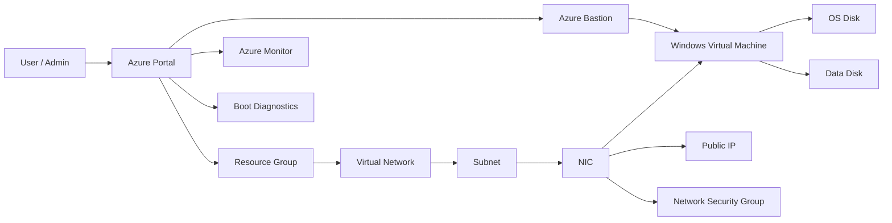

# Azure Virtual Machines Master Guide

## Virtualization, Deployment, Networking, Storage, Availability, and Cost-Optimized Windows VM Lab

> **Verified against current Microsoft Learn documentation** for Azure VM sizes, availability sets, availability zones, public IPs, NICs, managed disks, boot diagnostics, monitoring, and Azure Bastion. Azure for Students is designed for learners and includes credits/free monthly services with no credit card required.

## Table of Contents

* [Overview](#overview)
* [Why Azure Virtual Machines Matter](#why-azure-virtual-machines-matter)
* [Virtualization Background](#virtualization-background)
* [Azure VM Architecture](#azure-vm-architecture)
* [Azure VM Components Explained](#azure-vm-components-explained)
* [Choosing the Right VM Size](#choosing-the-right-vm-size)
* [Windows VM Deployment Lab](#windows-vm-deployment-lab)
* [Networking for Azure VMs](#networking-for-azure-vms)
* [Storage and Disks](#storage-and-disks)
* [Availability and Resilience](#availability-and-resilience)
* [Security Best Practices](#security-best-practices)
* [Monitoring and Operations](#monitoring-and-operations)
* [Cost Optimization for Student Subscriptions](#cost-optimization-for-student-subscriptions)
* [Interview Questions](#interview-questions)
* [Troubleshooting](#troubleshooting)
* [Cleanup](#cleanup)
* [Hands-On Summary](#hands-on-summary)
* [References](#references)

---

## Overview

Azure Virtual Machines (VMs) are one of the most important compute services in Microsoft Azure. They let you run Windows or Linux servers in the cloud without buying physical hardware. A VM gives you full control over the operating system, installed software, networking, storage, and security settings.

This guide focuses on **Azure Virtual Machines with Windows Server**, written for a **student Azure subscription** and optimized for **free or low-cost learning**.

Azure VMs are part of **Infrastructure as a Service (IaaS)**. That means Microsoft provides the underlying cloud infrastructure, while you manage the OS, patches, applications, and configuration. Azure also provides supporting services such as virtual networks, public IPs, disks, monitoring, availability options, and Bastion for secure access.

---

## Why Azure Virtual Machines Matter

Azure VMs are used for:

* Development and test environments
* Web servers
* Active Directory labs
* File servers
* Database servers
* Application hosting
* Training and certification labs
* Lift-and-shift migration from on-premises systems
* Disaster recovery and backup scenarios

If you already know AWS EC2, Azure Virtual Machines are the closest equivalent in Azure, but Azure integrates strongly with Azure networking, identity, monitoring, disks, and availability services.

---

## Virtualization Background

### What is virtualization?

Virtualization is the process of creating a software-based version of a computer. Instead of one physical server running one operating system, a hypervisor allows one physical host to run multiple isolated virtual machines.

### Why virtualization exists

Virtualization helps with:

* Better hardware utilization
* Cost savings
* Isolation between workloads
* Easy provisioning
* Snapshots, cloning, and portability
* Elastic scaling in cloud environments

### Hypervisor concept

A hypervisor is the layer that manages virtual machines on physical hardware.

* **Type 1 hypervisor**: Runs directly on hardware
* **Type 2 hypervisor**: Runs on top of an operating system

Cloud platforms such as Azure rely on large-scale hypervisor-based virtualization to deliver compute resources on demand.

### Why it matters in Azure

Azure VMs are built on virtualization so you can:

* Create servers in minutes
* Select CPU, RAM, disk, and network profiles
* Place workloads in different regions
* Improve availability with zones and availability sets
* Pay only for what you use

---

## Azure VM Architecture

A typical Azure VM solution includes these building blocks:

* **Subscription**
* **Resource Group**
* **Region**
* **Virtual Network**
* **Subnet**
* **Network Interface Card (NIC)**
* **Public IP**
* **Private IP**
* **Network Security Group (NSG)**
* **Virtual Machine**
* **OS Disk**
* **Data Disk**
* **Image**
* **Availability Set / Availability Zone**
* **Boot Diagnostics**
* **Azure Monitor**
* **Backup**
* **Bastion**
* **Managed Identity**
* **Extensions**

### Architecture diagram



### Suggested image placeholders

Replace these with your own screenshots or architecture images in your GitHub repo:

```md


```

---

## Azure VM Components Explained

## 1. Subscription

A subscription is the billing and governance boundary in Azure. All resources are created inside a subscription. For a student account, this is where your credits and quotas are managed.

**Why it matters:**
Without a subscription, you cannot deploy Azure resources.

---

## 2. Resource Group

A resource group is a logical container for related Azure resources.

**Use case:**
Put the VM, NIC, VNet, NSG, disks, and public IP in one resource group for easy management.

**Best practice:**
Use one resource group per lab, project, or environment.

---

## 3. Region

A region is a geographic location such as East US, Central India, or West Europe.

**Why it matters:**
Region affects latency, service availability, pricing, and availability options.

**Low-cost tip:**
Choose a region that supports the services you need and is available in your subscription.

---

## 4. Virtual Network

A virtual network (VNet) is your private network in Azure. It provides secure IP-based communication between Azure resources.

A VNet is the foundation for private connectivity between your VM and other resources.

---

## 5. Subnet

A subnet is a smaller network inside a VNet. You place VMs into subnets to organize traffic and apply policies.

**Use case:**
Separate web tier, app tier, and database tier.

---

## 6. Network Interface Card (NIC)

A NIC connects a VM to a VNet. Every Azure VM must have at least one NIC, and some VM sizes support multiple NICs. A NIC is the interconnection between a VM and a virtual network.

**Why it matters:**
The NIC carries private IP configuration, NSG association, and networking settings.

---

## 7. Public IP

A public IP enables internet-facing communication to Azure resources and can also provide outbound internet connectivity with a predictable address. Azure public IPs are available in Basic and Standard SKUs.

**Use case:**
Useful for lab access, RDP testing, and public-facing services.

**Security note:**
Avoid exposing RDP directly to the internet unless required.

---

## 8. Private IP

A private IP is used inside your VNet. It is not directly reachable from the internet.

**Use case:**
Internal application communication, backend servers, and private lab traffic.

---

## 9. Network Security Group (NSG)

An NSG is a virtual firewall used to allow or deny inbound and outbound traffic. You can apply it at the subnet level or NIC level.

**Use case:**
Allow RDP only from your IP, block unnecessary ports, and protect the VM.
NSGs are essential for secure cloud networking.

---

## 10. OS Disk

The OS disk contains the operating system of the VM. For a Windows VM, this is where Windows Server is installed.

**Use case:**
Booting the VM and storing system files.

---

## 11. Data Disk

A data disk is used for application data, logs, database files, backups, or secondary storage.

**Use case:**
Keep data separate from the operating system for better management and backup strategy.

---

## 12. Image

An image is the template used to create the VM operating system.

**Examples:**

* Windows Server 2022 Datacenter
* Windows Server 2019
* Windows 11 (where supported)
* Custom images

Azure Marketplace images are commonly used for VM creation.

---

## 13. VM Size

The size defines CPU, RAM, number of NICs, disk limits, and overall performance.

Azure offers many families of VM sizes for different workload types. The size families differ by compute, memory, storage, and specialized hardware needs.

**For a student lab:**
Start with a small, low-cost size and scale only when needed.

---

## 14. Availability Set

Availability sets are logical groupings of VMs that reduce the chance of correlated failures. Azure recommends placing two or more VMs in an availability set for higher availability. There is no cost for the availability set itself.

**Use case:**
Good for classic highly available workloads in regions where zones are not used.

---

## 15. Availability Zone

Availability zones are physically separate datacenter groups inside a region. They have independent power, cooling, and networking infrastructure.

**Use case:**
Use zones when you need higher resilience against datacenter-level failures.

---

## 16. Dedicated Host

A dedicated host is a physical server dedicated to your subscription.

**Use case:**
Useful for compliance, isolation, or licensing scenarios.

**Cost note:**
This is usually not required for a student lab and is typically more expensive than a normal VM deployment.

---

## 17. Azure Bastion

Azure Bastion provides secure RDP/SSH connectivity to VMs directly from the Azure portal over TLS, and your VM does not need a public IP address when using Bastion.

**Why it matters:**
This is one of the safest ways to access a VM.

---

## 18. Boot Diagnostics

Boot diagnostics helps diagnose VM boot failures by collecting serial logs and screenshots.

**Use case:**
Troubleshooting startup, black screen, and boot issues.

---

## 19. Azure Monitor

Azure Monitor helps collect and analyze VM metrics, logs, and alerting signals so you can monitor health and performance.

**Use case:**
Performance monitoring, diagnostics, alerts, and observability.

---

## 20. Managed Identity

A managed identity gives your VM an Azure identity without storing credentials in code or on the machine.

**Use case:**
Secure access to Azure services such as Storage, Key Vault, or Automation.

---

## 21. Extensions

Extensions add post-deployment functionality to a VM.

**Examples:**

* Custom Script Extension
* VM Access Extension
* Monitoring agent
* Security agent

---

## Choosing the Right VM Size

Azure VM size series are designed for different workloads such as general purpose, compute optimized, memory optimized, and specialized scenarios.

### Common VM families

| Family   | Best for                              | Notes                              |
| -------- | ------------------------------------- | ---------------------------------- |
| B-series | Low-cost dev/test and burst workloads | Good for student labs              |
| D-series | General purpose workloads             | Balanced CPU and memory            |
| E-series | Memory-intensive workloads            | Better for databases and analytics |
| F-series | Compute-heavy workloads               | Good for CPU-focused apps          |
| N-series | GPU workloads                         | Usually not needed for basic labs  |

### Recommendation for this lab

For a cost-optimized Windows VM lab, start with:

* **B-series** if available
* Otherwise a small **D-series** size
* Keep the workload minimal
* Turn on auto-shutdown

---

## Windows VM Deployment Lab

This lab creates one low-cost Windows VM for learning.

### Prerequisites

* Azure for Students account
* Active subscription
* Basic Azure portal access
* A strong password
* Your current public IP address if you want RDP access

Azure for Students is designed for learners and provides access without a credit card requirement.

---

### Step 1: Create a Resource Group

Use one resource group to keep everything organized.

```bash
az group create \
  --name rg-azure-vm-lab \
  --location eastus
```

---

### Step 2: Create a Virtual Network and Subnet

```bash
az network vnet create \
  --resource-group rg-azure-vm-lab \
  --name vnet-azure-vm-lab \
  --address-prefix 10.10.0.0/16 \
  --subnet-name subnet-vm \
  --subnet-prefix 10.10.1.0/24
```

---

### Step 3: Create a Network Security Group

```bash
az network nsg create \
  --resource-group rg-azure-vm-lab \
  --name nsg-azure-vm-lab
```

Allow RDP from your public IP only:

```bash
az network nsg rule create \
  --resource-group rg-azure-vm-lab \
  --nsg-name nsg-azure-vm-lab \
  --name Allow-RDP-MyIP \
  --priority 1000 \
  --direction Inbound \
  --access Allow \
  --protocol Tcp \
  --source-address-prefixes <YOUR_PUBLIC_IP>/32 \
  --source-port-ranges '*' \
  --destination-address-prefixes '*' \
  --destination-port-ranges 3389
```

---

### Step 4: Create the Windows VM

Choose a low-cost image and a small VM size.

```bash
az vm create \
  --resource-group rg-azure-vm-lab \
  --name vm-win-lab \
  --image Win2022Datacenter \
  --admin-username azureadmin \
  --admin-password "YourStrongPassword@123" \
  --size Standard_B2s \
  --vnet-name vnet-azure-vm-lab \
  --subnet subnet-vm \
  --nsg nsg-azure-vm-lab \
  --public-ip-sku Standard \
  --os-disk-size-gb 64 \
  --storage-sku StandardSSD_LRS
```

> If `Standard_B2s` is not available in your region or subscription, choose the smallest suitable VM size available.

---

### Step 5: Connect to the VM

Use Remote Desktop (RDP) from Windows:

1. Open Azure Portal
2. Go to the VM
3. Copy the public IP
4. Open Remote Desktop Connection
5. Connect using:

   * Username: `azureadmin`
   * Password: the one you set during deployment

---

### Step 6: Validate the VM

After login:

* Open `Server Manager`
* Check `Computer Name`
* Open `Disk Management`
* Check Windows Update
* Verify internet access
* Install required tools such as Notepad++, VS Code, or PowerShell modules if needed

---

## Explain Every Deployment Option

## Image

The image defines the operating system you start with.

**Examples:**

* Windows Server 2022
* Windows Server 2019
* Windows 11 (when supported)

---

## Size

The size defines performance and capacity.

**Key things to check:**

* Number of vCPUs
* RAM
* Temporary storage
* NIC count
* Disk throughput limits

---

## Availability Options

You will often see:

* No infrastructure redundancy required
* Availability set
* Availability zone

### What they mean

* **No infrastructure redundancy required**: simplest, cheapest lab choice
* **Availability set**: protects against planned/unplanned host issues
* **Availability zone**: protects against datacenter-level failures

---

## Security Type

Depending on region and image support, you may see security-related deployment options such as standard security posture or trusted launch style options.

**Lab recommendation:**
Use the simplest supported option for a student lab unless you specifically want to learn advanced security features.

---

## Disk Type

Select a disk based on your goal:

* **Standard HDD**: cheapest, lowest performance
* **Standard SSD**: better balance for labs
* **Premium SSD**: higher performance, higher cost
* **Ultra Disk**: high-end performance, not for basic labs

Azure managed disks come in several types, including Ultra Disks, Premium SSD v2, Premium SSD, Standard SSD, and Standard HDD.

---

## OS Disk

This is where Windows is installed.

**Tip:**
Use a modest size for labs. Large OS disks increase cost unnecessarily.

---

## Data Disk

Use a data disk when you want separate storage for:

* application files
* downloads
* databases
* logs
* backups

---

## Public IP Settings

Public IP gives you external reachability. If you use Bastion, you may not need a public IP for day-to-day access. Bastion is designed to connect securely without exposing RDP/SSH to the public internet.

---

## NIC Settings

The NIC connects the VM to the VNet and subnet. Some VM sizes support multiple NICs, which lets a VM connect to multiple subnets.

---

## Accelerated Networking

Accelerated Networking reduces latency and CPU utilization by enabling SR-IOV on supported VM types.

**Use case:**
Performance-sensitive workloads.

**Lab note:**
Use it only if supported and needed.

---

## Boot Diagnostics

Enable boot diagnostics so you can troubleshoot startup failures. It gives you serial logs and screenshots of the boot process.

---

## Extensions

Extensions are extra components added after deployment.

**Examples:**

* Install custom tools
* Join a domain
* Enable monitoring
* Run scripts automatically

---

## Auto-Shutdown

Auto-shutdown is a very useful low-cost feature for student labs.

**Why use it:**

* Avoid accidental overnight charges
* Stop the VM automatically
* Save subscription credits

---

## Tags

Tags help organize resources.

**Example tags:**

* `Project=AzureVM-Lab`
* `Owner=Shiva`
* `Environment=Dev`
* `CostCenter=Training`

---

## Secondary Network Interface

A VM can have more than one NIC if the VM size supports it. Multiple NICs allow different traffic flows and subnet separation.

**Use case:**

* DMZ + internal network
* Network appliances
* Advanced routing labs

---

## Availability and Resilience

## Availability Set

An availability set places VMs across fault and update domains to reduce the chance that a single maintenance event or host failure takes down everything. Azure recommends using two or more VMs in an availability set for redundancy.

## Availability Zone

An availability zone protects against datacenter-level failure by placing VMs in separate physically independent zones within a region.

## Dedicated Host

Use a dedicated host when you need dedicated physical isolation. For a student lab, this is usually not needed.

---

## Networking for Azure VMs

### Core networking concepts

* **VNet**: private network
* **Subnet**: section of the network
* **NIC**: attaches VM to network
* **Private IP**: internal addressing
* **Public IP**: internet-facing address
* **NSG**: traffic filter
* **Bastion**: secure portal-based VM access

### RDP access

For a Windows VM, RDP is the standard way to connect. For security, only allow RDP from your IP or use Bastion.

### Internet access

Internet access can be provided by:

* Public IP
* Default outbound connectivity
* NAT Gateway
* Firewall-based routing

### Azure Bastion option

Bastion is the preferred secure access path for many labs because it avoids exposing RDP directly.

### Secondary NIC labs

A second NIC is useful when you want to practice:

* multi-subnet design
* routing
* network segmentation
* advanced virtual appliance scenarios

### DNS basics

Azure VMs rely on DNS for name resolution. In enterprise designs, DNS may come from:

* Azure-provided DNS
* custom DNS servers
* Private DNS zones

---

## Storage and Disks

Azure managed disks are the standard disk option for Azure VMs, and the available disk types include Ultra Disks, Premium SSD v2, Premium SSD, Standard SSD, and Standard HDD.

### OS Disk vs Data Disk

| Item           | Purpose                     | Best Practice              |
| -------------- | --------------------------- | -------------------------- |
| OS Disk        | Windows OS and system files | Keep modest size           |
| Data Disk      | App data and files          | Separate from OS           |
| Temporary Disk | Cache/scratch space         | Do not store critical data |

### Disk type guidance

* **Standard HDD**: lowest cost, lowest performance
* **Standard SSD**: good cost-performance balance
* **Premium SSD**: higher performance
* **Ultra Disk**: specialized high-performance scenarios

### Disk initialization in Windows

After attaching a new data disk:

1. Open Disk Management
2. Bring disk online
3. Initialize disk
4. Create volume
5. Assign drive letter
6. Format it

---

## Security Best Practices

* Use a strong admin password
* Restrict RDP to your IP
* Prefer Bastion over public RDP
* Keep NSG rules minimal
* Use least privilege
* Turn on monitoring and diagnostics
* Patch the VM regularly
* Use managed identity where possible
* Delete unused public IPs and disks
* Do not leave test VMs running

---

## Monitoring and Operations

Azure Monitor helps you track VM health and performance. Boot diagnostics helps with startup issues. Together they form the base of good operational visibility.

### What to watch

* CPU percentage
* Available memory
* Disk queue depth
* Network in/out
* Reboot events
* Service health
* Boot issues

### Useful tools

* Azure Monitor
* Log Analytics
* Boot Diagnostics
* Activity Log
* Alerts
* Azure Backup

---

## Cost Optimization for Student Subscriptions

Azure for Students gives learners access to Azure services and credits without requiring a credit card.

### Cost-saving rules

* Use the smallest VM that fits your lab
* Prefer B-series or small D-series if available
* Keep the VM stopped when not in use
* Use auto-shutdown
* Delete unused public IPs and disks
* Avoid premium storage unless needed
* Avoid dedicated hosts and advanced networking SKUs unless required
* Use one resource group and clean up after the lab

### Good student-lab defaults

* Windows Server image
* Small VM size
* Standard SSD
* One public IP only if needed
* NSG locked to your IP
* Auto-shutdown enabled

---

## Interview Questions

### Beginner

**Q1. What is Azure Virtual Machine?**
A VM is a cloud server that runs an operating system and applications.

**Q2. What is the difference between a VM and a container?**
A VM includes a full OS; a container shares the host OS kernel.

**Q3. What is a resource group?**
A logical container for related Azure resources.

### Intermediate

**Q4. What is the difference between public IP and private IP?**
Public IP is internet-facing; private IP is internal to the VNet.

**Q5. Why use availability sets?**
To reduce correlated failures and improve application availability.

**Q6. Why use Azure Bastion?**
To connect to VMs securely without exposing RDP/SSH publicly.

### Advanced

**Q7. Difference between availability zones and availability sets?**
Zones protect against datacenter failure; availability sets protect against host-level correlated failures.

**Q8. Why use multiple NICs on a VM?**
To separate traffic paths and connect to multiple subnets.

**Q9. When would you use managed identity?**
When the VM needs secure access to Azure services without storing secrets.

### Scenario-based

**Q10. You cannot RDP to a VM. What will you check first?**
NSG rules, public IP, Windows firewall, username/password, and whether the VM is running.

---

## Troubleshooting

### RDP not working

Check:

* VM is running
* Public IP exists
* NSG allows port 3389
* Windows firewall permits RDP
* Your IP is allowed
* Credentials are correct

### VM is slow

Check:

* VM size
* CPU utilization
* Memory pressure
* Disk type
* Background processes

### Disk not visible

Check:

* Disk attached correctly
* Disk initialized in Disk Management
* Drive letter assigned

### No internet access

Check:

* NSG outbound rules
* Route table
* DNS settings
* Public IP or NAT path

### Boot failure

Check:

* Boot diagnostics
* Serial log
* OS disk health
* Recent configuration changes

---

## Cleanup

When you finish the lab, delete everything to avoid charges.

### Cleanup order

1. Stop and deallocate the VM
2. Delete the VM
3. Delete NIC
4. Delete public IP
5. Delete disks
6. Delete VNet and subnet
7. Delete the resource group

### Azure CLI cleanup

```bash
az group delete \
  --name rg-azure-vm-lab \
  --yes \
  --no-wait
```

---

## Hands-On Summary

In this lab, you learned how to:

* Understand virtualization and Azure VM concepts
* Create a Windows VM in Azure
* Select an image and size
* Configure network access
* Add NSG rules
* Understand public and private IPs
* Use disks properly
* Learn availability options
* Improve security
* Monitor and troubleshoot the VM
* Keep the deployment low-cost

This is the foundation for deeper Azure learning, including:

* Azure networking
* Azure storage
* Azure security
* Azure monitoring
* Azure backup
* Azure automation
* Azure hybrid connectivity

---

## Suggested Repository Structure

```text
azure-vm-master-guide/
├── README.md
├── images/
│   ├── azure-vm-architecture.png
│   ├── windows-vm-flow.png
│   └── azure-vm-components.png
├── scripts/
│   ├── create-vnet.sh
│   ├── create-vm.sh
│   └── cleanup.sh
└── docs/
    └── notes.md
```

---

## References

* Azure for Students
* Azure Virtual Machine sizes
* Azure Availability Sets
* Azure Availability Zones
* Azure Virtual Network
* Azure Public IPs
* Azure Network Interfaces
* Azure Managed Disks
* Azure Boot Diagnostics
* Azure Monitor for VMs
* Azure Bastion

---

## Final Note

This README is designed to be used as a professional GitHub learning document for Azure Virtual Machines, with a strong focus on Windows VM deployment, core components, secure access, availability, storage, monitoring, and cost control.
